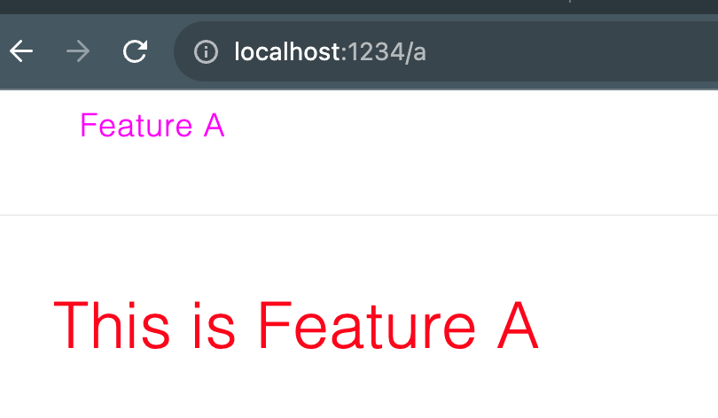
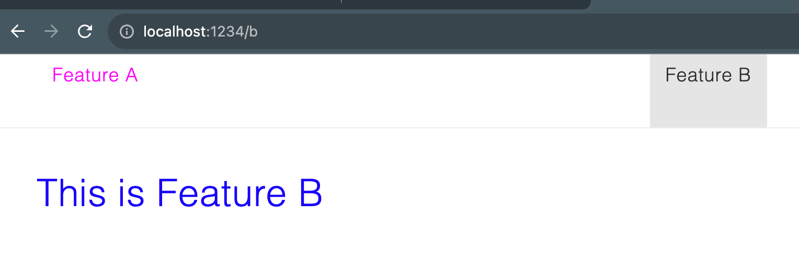

Reproduction of an issue in [parcel 2.9.3](https://parceljs.org/)

# The issue

When running the project with `parcel serve`, the same css file is included multiple times. Because of different css specificity,
navigating back and forth in the app will cause colors to change.

# Building/running

- nvm use
- npm install
- npm start

This will run the app with `parcel serve`, you can view it at 'localhost: 1234'

# Problem description

We have an overview page with links to several features, which are lazily loaded react components (with React.lazy).

Navigate to [Feature A](http://localhost:1234/a). Note that 'This is feature A' is red.

Navigate away from the page, e.g. to [Feature B](http://localhost:1234/b)

Now go back to [Feature A](http://localhost:1234/a). Because of some styles being re-included into the page, the font is now purple:

# What is going on?

# Overview of the project

