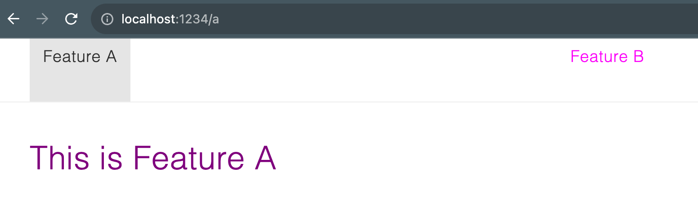

Reproduction of [an issue](https://github.com/parcel-bundler/parcel/issues/9277) in [parcel 2.9.3](https://parceljs.org/)

# The issue

When running the project with `parcel serve`, the same css file is included multiple times. Because of different css specificity,
navigating back and forth in the app will cause colors to change.

# Building/running

- nvm use
- npm install
- npm start

This will run the app with `parcel serve`, you can view it at 'localhost: 1234'

# Problem description

We have an overview page with links to several features, which are lazily loaded react components (with `React.lazy`).

Navigate to [Feature A](http://localhost:1234/a). Note that 'This is feature A' is red.


Navigate away from the page, e.g. to [Feature B](http://localhost:1234/b)


Now go back to [Feature A](http://localhost:1234/a). Because of some styles being re-included into the page, the font is now purple:



# What is going on?

When navigating to [Feature A](http://localhost:1234/a), two css files are loaded:

- FeatureC.2a93835a.css?1695828292409
- FeatureA.451eac7a.css?1695828292410

FeatureA.css contains the styles relevant for `FeatureA`, included via `import styles from './styles.css'` in FeatureA.tsx:

```
.q3bWrW_featureA {
  color: red;
}

.q3bWrW_feature {
  font-weight: lighter;
}
```

However, some styles for components that are used in multiple pages are somehow included in the css sources for FeatureC.

```
/* this style is for the general 'heading' component, declared in components/Heading/styles.css */
.zWerJW_xlarge {
  color: purple;
  font-size: 2rem;
  line-height: 2.5rem;
}

/* the following styles are declared in features/featureC/styles.css */
.wWSU2W_featureC {
  color: green;
}

.wWSU2W_feature {
  font-weight: bold;
}
```

The heading 'This is Feature A' gets both css classes .xlarge applied (purple), but also .featureA, which turns it red.

`<h1 class="q3bWrW_featureA zWerJW_xlarge">This is Feature A</h1>`

This is what I would *expect*: the more specific declaration gets loaded last and overwrites the more general.

If we now navigate to [Feature B](http://localhost:1234/b), the styles for the 'general heading component' that are baked into FeatureC.css
are loaded *again*, but this time with a different cache-busting timestamp, but with the same contents:

- FeatureC.2a93835a.css?1695829079598
- FeatureB.b0f5413c.css?1695829079599

Now we go back to [Feature A](http://localhost:1234/a). All css files have already been loaded, so no new requests are made.

If we inspect 'This is Feature A', we see:


The topmost style (purple) comes from the *second* loading of the xlarge style (from FeatureC.2a93835a.css?1695829079598) and is taken because the
corresponding css file was included last.

# Overview of the project

There are some general purpose components in /components: links, headings, text components. The Heading component declares that
'xlarge' headings should be purple.

On the overview page (App.tsx) we include links to several subpages, which are placed in /features.

Those features are lazily included (`const FeatureA = React.lazy(() => import('./features/featureA/FeatureA'))`), so that we only load the js/css resources for 'feature A' when the user actually navigates there.

# Additional observations

- In the case of a production build with `parcel build`, the style for the general purpose component Heading `.zWerJW_xlarge` is still put into FeatureC86ce4b23.css. However, because cache-busting by appending `?{timestamp}` is not enabled in a production build, the FeatureC css file is only loaded once and the problem does not occur. Still, it looks a bit weird that we load 'FeatureC.css' when accessing Feature A.
- The order of lazy includes in App.tsx seems to matter. The first component declared is `const FeatureC = React.lazy(() => import('./features/featureC/FeatureC'))`. If I switch up the order and declare e.g. `const FeatureB = React.lazy(() => import('./features/featureB/FeatureB'))` first, the (purple) 'xlarge' style is put into FeatureB.css rather than FeatureC.css. It seems like the 'general purpose styles' that are used in several lazily loaded components are put into the css file of the first component.
